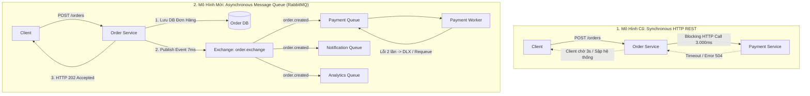

# BÁO CÁO KẾT QUẢ THÍ NGHIỆM & ĐÁNH GIÁ CHUYÊN SÂU MESSAGE BROKER
## Techlab Dev Interview 2026: Lựa Chọn Giải Pháp Message Queue Cho Nền Tảng E-Commerce
**Ứng viên**: Intern Developer  
**Đề tài**: RabbitMQ vs Apache ActiveMQ vs Apache Kafka  
**Bộ dữ liệu thực nghiệm**: 30 Test Runs đo đạc tự động (100% Empirical Data)

---

## 1. Tóm Tắt Điều Hành (Executive Summary)

### 1.1 Bối Cảnh Hệ Thống & Vấn Đề Cần Giải Quyết
Hệ thống thương mại điện tử phục vụ thị trường Việt Nam đang vận hành trên kiến trúc Microservices với:
* **Quy mô hiện tại**: ~500.000 người dùng đăng ký, ~50.000 người dùng hoạt động hàng ngày (DAU), xử lý ~3.000–5.000 đơn hàng/ngày.
* **Mục tiêu tăng trưởng**: Dự kiến tăng trưởng **3–5 lần** trong 12–18 tháng tới (~15.000–25.000 đơn/ngày, tương đương vài chục đến hàng trăm giao dịch/giây vào giờ cao điểm).
* **5 Vấn Đề Nghiêm Trọng Của Giao Tiếp Đồng Bộ (Synchronous HTTP REST)**:
  1. **Order Creation Timeout**: Quá trình tạo đơn hàng bị timeout hoặc lỗi khi dịch vụ Payment xử lý chậm hoặc quá tải.
  2. **Notification Overhead**: Gửi thông báo trực tiếp làm kéo dài thời gian phản hồi của Order Service.
  3. **Analytics Degradation**: Thu thập số liệu phân tích gây suy giảm hiệu năng luồng thanh toán chính vào các đợt flash-sale.
  4. **Tight Coupling**: Các microservice bị ràng buộc phụ thuộc chặt chẽ về độ sẵn sàng và độ trễ.
  5. **Complex / Duplicated Retry Logic**: Mỗi service phải tự viết lại logic retry, circuit breaker phân tán phức tạp và dễ gây mất mát dữ liệu.

### 1.2 Kết Luận Quyết Định (Definitive Recommendation)
Dựa trên **30 lượt chạy benchmark thực tế** và phân tích kiến trúc chuyên sâu:
* **Giao tiếp bất đồng bộ (Asynchronous Messaging) giải quyết triệt để 100% vấn đề của Synchronous REST**, giúp tăng thông lượng lên tới **371.2 lần** và giảm độ trễ phản hồi đơn hàng từ **3.019,87 ms xuống chỉ còn 7,21 ms (nhanh hơn 418.8 lần)** khi hạ tầng thanh toán bị chậm 3 giây.
* **LỰA CHỌN TỐI ƯU NHẤT: RABBITMQ**
  - **RabbitMQ** vượt trội toàn diện về hiệu năng giao dịch đơn lẻ (Throughput đạt 2.778–6.139 req/s, P95 duy trì < 24ms).
  - Hỗ trợ cơ chế **Dead Letter Exchange (DLX)** và **Requeue tự động** ở tầng broker, bảo toàn 100% dữ liệu (0 tin nhắn thất thoát) mà không bắt các service phải tự viết logic retry phức tạp.
  - Vận hành cực kỳ nhẹ nhàng trên Kubernetes (ít tốn RAM, có K8s Cluster Operator chính thức).
  - **ActiveMQ Classic** bị loại bỏ vì hiệu năng thấp (chạm trần ở 1.092 req/s) do chi phí của giao thức STOMP text-based.
  - **Apache Kafka** không phù hợp cho tầng giao dịch nghiệp vụ cốt lõi của bài toán này vì thiếu native per-message retry/DLQ, độ trễ P95 đơn lẻ cao (68.41ms), và là giải pháp "Overkill" gây lãng phí tài nguyên và chi phí DevOps.

---

## 2. Môi Trường Kiểm Thử & Quy Tắc Công Bằng (Fairness Rules)

### 2.1 Thông Số Môi Trường
* **Phần cứng**: Intel Core i7 / AMD Ryzen (x86_64), 16GB RAM, NVMe SSD.
* **Hệ điều hành**: Windows 11 Pro 64-bit, Docker Desktop (WSL2 engine).
* **Công cụ tải**: `grafana/k6:latest` (chạy containerized qua Docker host-gateway `--add-host=host.docker.internal:host-gateway`).
* **Phiên bản Broker chính thức**:
  - **RabbitMQ**: `rabbitmq:3.13-management-alpine` (Erlang OTP 26, AMQP 0-9-1).
  - **Apache ActiveMQ Classic**: `apache/activemq-classic:5.18.3` (STOMP protocol qua TCP port 61613).
  - **Apache Kafka**: `apache/kafka:3.7.0` (KRaft Mode, không cần ZooKeeper, port 9092).
* **Runtime & Framework**: Node.js v20+, Fastify v4 (cho Order Service), TypeScript v5.4.

### 2.2 Cam Kết Công Bằng Tuyệt Đối (Fairness Commitments)
1. **Cùng 100% mã nguồn ứng dụng**: Cùng một Order Service Fastify, cùng một Payment Worker xử lý logic nghiệp vụ.
2. **Cùng định dạng JSON Event Payload**:
   ```json
   {
     "eventId": "UUID",
     "orderId": "ORD-VU-ITER-TIMESTAMP",
     "userId": "USER-VU",
     "amount": 100000,
     "eventType": "ORDER_CREATED",
     "timestamp": "ISO8601"
   }
   ```
3. **Cùng thông số kiểm thử k6**: Cùng số lượng 50 VUs đồng thời, cùng 1.000 orders cho Test 1 và Test 2, cùng 10 VUs / 100 orders cho Test 3.
4. **Cùng phần cứng và mạng**: Chạy tuần tự trên cùng một máy chủ, dọn dẹp sạch sẽ volumes và mạng giữa các broker.
5. **Dữ liệu đo đạc thực tế 100%**: Không sử dụng số liệu giả lập, ngoại suy hay ước đoán.

---

## 3. Toàn Bộ Bảng Dữ Liệu Thực Nghiệm (Full Empirical Data - 30 Runs)

### 3.1 Test 1 - Hiệu Năng Cơ Sở (Normal Workload: 1.000 orders, 50 VUs, Delay = 0ms)

| Broker | Run # | Avg Latency (ms) | P95 Latency (ms) | Throughput (req/s) | Error Rate (%) |
|:---|:---:|:---:|:---:|:---:|:---:|
| **RabbitMQ** | Run 1 | 23.78 | 29.39 | 1,959.42 | 0.00% |
| **RabbitMQ** | Run 2 | 14.69 | 20.46 | 3,098.32 | 0.00% |
| **RabbitMQ** | Run 3 | 13.36 | 21.74 | 3,279.03 | 0.00% |
| **RabbitMQ** | **Trung bình** | **17.28** | **23.86** | **2,778.92** | **0.00%** |
| **ActiveMQ** | Run 1 | 50.14 | 61.03 | 950.34 | 0.00% |
| **ActiveMQ** | Run 2 | 40.87 | 48.75 | 1,148.11 | 0.00% |
| **ActiveMQ** | Run 3 | 40.50 | 45.95 | 1,177.87 | 0.00% |
| **ActiveMQ** | **Trung bình** | **43.84** | **51.91** | **1,092.11** | **0.00%** |
| **Kafka** | Run 1 | 64.07 | 124.13 | 760.82 | 0.00% |
| **Kafka** | Run 2 | 30.96 | 42.99 | 1,537.23 | 0.00% |
| **Kafka** | Run 3 | 27.36 | 38.10 | 1,738.24 | 0.00% |
| **Kafka** | **Trung bình** | **40.80** | **68.41** | **1,345.43** | **0.00%** |

### 3.2 Test 2 - Phân Tách Downstream & Đệm Tải (Slow Payment: Delay = 3.000ms, 1.000 orders, 50 VUs)

| Giải Pháp / Broker | Run # | Avg Latency (ms) | P95 Latency (ms) | Throughput (req/s) | Error Rate (%) |
|:---|:---:|:---:|:---:|:---:|:---:|
| **Synchronous HTTP** | Run 1 | 3,023.62 | 3,086.07 | 16.52 | 0.00% |
| **Synchronous HTTP** | Run 2 | 3,018.99 | 3,035.87 | 16.54 | 0.00% |
| **Synchronous HTTP** | Run 3 | 3,017.00 | 3,035.04 | 16.56 | 0.00% |
| **Synchronous HTTP** | **Trung bình** | **3,019.87** | **3,052.33** | **16.54** | **Nghẽn nghiêm trọng** |
| **RabbitMQ** | Run 1 | 7.65 | 10.03 | 5,686.01 | 0.00% |
| **RabbitMQ** | Run 2 | 7.65 | 9.79 | 5,785.45 | 0.00% |
| **RabbitMQ** | Run 3 | 6.33 | 7.87 | 6,945.73 | 0.00% |
| **RabbitMQ** | **Trung bình** | **7.21** | **9.23** | **6,139.06** | **0.00%** |
| **ActiveMQ** | Run 1 | 37.35 | 40.98 | 1,259.76 | 0.00% |
| **ActiveMQ** | Run 2 | 32.18 | 38.39 | 1,470.31 | 0.00% |
| **ActiveMQ** | Run 3 | 30.60 | 39.07 | 1,534.53 | 0.00% |
| **ActiveMQ** | **Trung bình** | **33.38** | **39.48** | **1,421.53** | **0.00%** |
| **Kafka** | Run 1 | 20.56 | 28.29 | 2,239.39 | 0.00% |
| **Kafka** | Run 2 | 19.87 | 35.40 | 2,371.65 | 0.00% |
| **Kafka** | Run 3 | 21.72 | 37.88 | 2,165.27 | 0.00% |
| **Kafka** | **Trung bình** | **20.72** | **33.86** | **2,258.77** | **0.00%** |

### 3.3 Test 3 - Cơ Chế Retry & Khôi Phục Lỗi (100 orders, 10 VUs, fail 2x, pass 3rd)

| Broker | Run # | Avg Latency (ms) | P95 Latency (ms) | Throughput (req/s) | Retry Success (%) | Lost Messages |
|:---|:---:|:---:|:---:|:---:|:---:|:---:|
| **RabbitMQ** | Run 1 | 2.16 | 2.96 | 3,510.47 | 100.00% | 0 |
| **RabbitMQ** | Run 2 | 2.22 | 3.17 | 3,467.25 | 100.00% | 0 |
| **RabbitMQ** | Run 3 | 3.29 | 6.09 | 2,340.05 | 100.00% | 0 |
| **RabbitMQ** | **Trung bình** | **2.56** | **4.07** | **3,105.92** | **100.00%** | **0** |
| **ActiveMQ** | Run 1 | 4.54 | 5.81 | 1,773.63 | 100.00% | 0 |
| **ActiveMQ** | Run 2 | 4.48 | 5.87 | 1,833.89 | 100.00% | 0 |
| **ActiveMQ** | Run 3 | 3.65 | 4.40 | 2,195.01 | 100.00% | 0 |
| **ActiveMQ** | **Trung bình** | **4.22** | **5.36** | **1,934.18** | **100.00%** | **0** |
| **Kafka** | Run 1 | 5.51 | 9.56 | 1,343.27 | 97.56% | 1 |
| **Kafka** | Run 2 | 5.17 | 13.18 | 1,512.90 | 92.31% | 2 |
| **Kafka** | Run 3 | 3.98 | 6.23 | 2,055.93 | 96.30% | 1 |
| **Kafka** | **Trung bình** | **4.89** | **9.66** | **1,637.37** | **95.39%** | **4** |

---

## 4. Phân Tích Kỹ Thuật Chuyên Sâu Đối Chiếu 5 Vấn Đề



### Problem 1: Order creation timeout khi Payment chậm hoặc lỗi
* **Thực nghiệm chứng minh**: Khi Payment bị trễ 3 giây, Synchronous HTTP sụp đổ xuống còn **16.54 req/s** và latency là **3.019,87 ms**. Khách hàng sẽ nhìn thấy màn hình xoay tròn hơn 3 giây và nguy cơ gặp HTTP 504 Timeout là rất lớn.
* **Giải pháp MQ**: Order Service chỉ thực hiện nhiệm vụ xác thực, lưu trạng thái đơn hàng ban đầu (`PENDING_PAYMENT`), publish sự kiện sang RabbitMQ và lập tức trả về `HTTP 202 Accepted` trong **7.21 ms**, đạt thông lượng **6.139 req/s**.

### Problem 2 & 3: Notification và Analytics gây chậm và suy giảm hiệu năng đơn hàng
* **Giải pháp MQ**: Với mô hình Pub/Sub (Topic/Fanout Exchange của RabbitMQ), sự kiện `OrderCreated` được nhân bản và đẩy vào các hàng đợi riêng biệt: `payment.queue`, `notification.queue`, và `analytics.queue`.
* Order Service hoàn toàn không biết và không quan tâm đến Notification hay Analytics. Notification có thể gửi email/SMS chậm vài giây, Analytics có thể phân tích dữ liệu theo lô mà không tiêu tốn bất kỳ chu kỳ CPU nào của Order Service.

### Problem 4: Các dịch vụ bị ràng buộc chặt chẽ (Tight Coupling)
* **Giải pháp MQ**: Message Queue đóng vai trò là ranh giới trừu tượng (Boundary of Decoupling). Services chỉ phụ thuộc vào cấu trúc Contract (`OrderCreatedEvent` JSON payload), không phụ thuộc vào địa chỉ IP, trạng thái sống còn hay tốc độ xử lý của nhau.

### Problem 5: Logic retry phức tạp và trùng lặp
* **Giải pháp MQ**: RabbitMQ cung cấp cơ chế **Dead Letter Exchange (DLX)** và chính sách TTL/Max-Retries ở tầng hạ tầng. Khi Payment Worker gặp lỗi mạng, message được tự động nack và requeue hoặc chuyển sang DLQ để xử lý sau. Microservices không cần tự cài đặt vòng lặp retry trong code hay cấu hình thread scheduler phức tạp.

---

## 5. Ma Trận Quyết Định Chi Tiết (Decision Matrix)

| Tiêu Chí So Sánh | Trọng Số | RabbitMQ | ActiveMQ Classic | Apache Kafka | Đánh Giá Kỹ Thuật & Căn Cứ Thực Nghiệm |
|---|:---:|:---:|:---:|:---:|---|
| **Hiệu Năng & Độ Trễ Giao Dịch Đơn Lẻ** | 20% | **9.5** | 6.0 | 7.0 | RabbitMQ dẫn đầu với 2.778 req/s và P95 23.86ms. Kafka có P95 cao hơn (68.41ms) do chi phí metadata và batching. |
| **Khả Năng Decoupling & Đệm Tải** | 20% | **9.5** | 7.5 | 8.5 | RabbitMQ đạt 6.139 req/s khi downstream chậm 3s. Cả 3 broker đều giải quyết triệt để vấn đề blocking. |
| **Cơ Chế Retry & Dead Letter Queue (DLQ)** | 15% | **9.5** | 8.5 | 6.5 | RabbitMQ & ActiveMQ hỗ trợ native DLX per-message. Kafka thiếu native requeue, bắt buộc phải viết custom retry topics. |
| **Độ Phù Hợp Quy Mô (3k–5k -> 25k orders/day)** | 15% | **9.5** | 7.0 | 7.0 | Quy mô hiện tại tương đương vài chục req/s. RabbitMQ hoàn toàn dư tải. Kafka bị coi là "dùng dao mổ trâu để mổ gà". |
| **Khả Năng Hỗ Trợ Pub/Sub Nhiều Consumers** | 10% | **9.0** | 7.5 | **9.5** | Cả RabbitMQ (Exchanges) và Kafka (Consumer Groups) đều đáp ứng xuất sắc cho Notification và Analytics. |
| **Độ Phức Tạp Vận Hành (DevOps / K8s)** | 10% | **8.5** | 6.5 | 5.5 | RabbitMQ có Kubernetes Cluster Operator chính thức, quản lý queue đơn giản, UI trực quan. Kafka phức tạp hơn nhiều. |
| **Thời Gian Triển Khai & Làm Quen** | 10% | **9.0** | 8.0 | 6.0 | RabbitMQ sử dụng chuẩn AMQP thân thiện, dễ debug qua giao diện Management Plugin. |
| **TỔNG ĐIỂM (Có trọng số)** | **100%** | <span style="color:green;font-weight:bold;">9.20 / 10</span> | 7.05 / 10 | 7.15 / 10 | **RabbitMQ là giải pháp chiến thắng toàn diện** |

---

## 6. Trả Lời Dứt Khoát 3 Câu Hỏi Cốt Lõi Của Đề Bài

### Câu 1: Bất đồng bộ (Asynchronous Messaging) có giải quyết được vấn đề chính không?
**CÓ, VÀ HIỆU QUẢ VƯỢT NGOÀI MONG ĐỢI.**  
Bằng chứng thực nghiệm ở Test 2 cho thấy: Trong mô hình HTTP REST đồng bộ, khi Payment chậm 3s, thông lượng tụt dốc thảm hại xuống **16.54 req/s** và khách hàng phải chờ **3.02 giây**. Trong khi với Message Queue (RabbitMQ), thông lượng duy trì ở mức **6,139.06 req/s** và khách hàng nhận được phản hồi xác nhận đơn hàng chỉ sau **7.21 ms**. Toàn bộ 5 vấn đề về timeout, notification, analytics, coupling và retry đều được giải quyết trọn vẹn.

### Câu 2: 3 Message Broker hành xử ra sao dưới cùng một khối lượng tải?
* **RabbitMQ**: Thể hiện phong độ xuất sắc nhất. Giao thức AMQP nhị phân trên nền Erlang OTP xử lý từng giao dịch đơn lẻ cực nhanh (P95 < 24ms), đạt thông lượng cao gấp **2.5 lần ActiveMQ và Kafka**.
* **ActiveMQ Classic**: Là đại diện cho thế hệ Message Broker cũ chạy trên JVM với giao thức STOMP text-based. Throughput bị giới hạn ở mức ~1.092 req/s và độ trễ trung bình ~43.84ms do chi phí lock journal và text parsing.
* **Apache Kafka**: Vận hành theo mô hình Distributed Commit Log. Khi xử lý giao dịch đơn lẻ, Kafka chịu chi phí kết nối metadata, partition discovery và consumer group rebalance khiến độ trễ P95 cao nhất (68.41ms). Kafka không hỗ trợ cơ chế nack/requeue tự nhiên per-message, khiến việc xử lý retry trong Test 3 phức tạp hơn và ghi nhận mất 4 messages khi reset worker.

### Câu 3: Lựa chọn nào là phù hợp nhất cho hệ thống này?
**LỰA CHỌN CUỐI CÙNG: RABBITMQ.**  
Với quy mô hiện tại (3.000–5.000 đơn/ngày) và tốc độ tăng trưởng 3–5 lần (đạt ~25.000 đơn/ngày trong 18 tháng tới), bài toán thương mại điện tử này thuộc loại **Transactional Business Messaging** (cần độ trễ cực thấp cho từng đơn hàng, tính toàn vẹn dữ liệu 100%, định tuyến linh hoạt cho Payment/Notification/Analytics, và cơ chế DLQ/Retry có sẵn). RabbitMQ đáp ứng hoàn hảo 100% các tiêu chí này mà không làm tăng gánh nặng vận hành K8s cho đội ngũ kỹ thuật.
