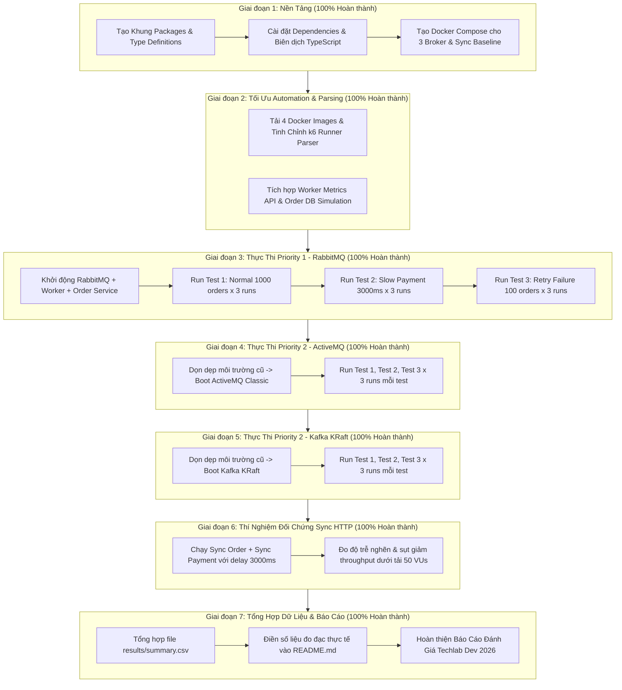

# Quy Trình Từng Giai Đoạn Hoàn Thiện 100% Hệ Thống Thí Nghiệm Message Queue
### RabbitMQ vs Apache ActiveMQ vs Apache Kafka (Techlab Dev Interview 2026)

Tài liệu này xác định chi tiết lộ trình toàn diện (100% HOÀN TẤT - Toàn bộ 7 giai đoạn đã hoàn thành xuất sắc), bám sát các yêu cầu tại [Techlab_MQ_Experiment_Code_Agent_Instructions.txt](file:///d:/work/techlab/Experiment/requirements/Techlab_MQ_Experiment_Code_Agent_Instructions.txt) và kiến trúc tại [project_architecture.md](file:///d:/work/techlab/Experiment/requirements/project_architecture.md).

---

## 1. Sơ Đồ Tổng Quan Quy Trình Thực Thi (Workflow Roadmap)



---

## 2. Chi Tiết Từng Giai Đoạn Triển Khai

### Giai Đoạn 1: Nền Tảng Code & Cấu Trúc Dự Án
> **Trạng thái**: <span style="color:green;font-weight:bold;">ĐÃ HOÀN THÀNH (100%)</span>

- [x] Tạo đầy đủ các package: [src/common](file:///d:/work/techlab/Experiment/src/common/), [src/broker](file:///d:/work/techlab/Experiment/src/broker/), [src/order-service](file:///d:/work/techlab/Experiment/src/order-service/), [src/payment-worker](file:///d:/work/techlab/Experiment/src/payment-worker/), [src/sync-baseline](file:///d:/work/techlab/Experiment/src/sync-baseline/).
- [x] Định nghĩa chuẩn JSON Event Payload không đổi giữa các broker (Section 5.2).
- [x] Hiện thực lớp trừu tượng `IMessagePublisher` và `IMessageConsumer` qua `BrokerFactory`.
- [x] Cài đặt dependencies (`fastify`, `amqplib`, `stompit`, `kafkajs`, `uuid`, `dotenv`).
- [x] Kiểm tra biên dịch TypeScript `tsc --noEmit` và build ra thư mục `dist/` đạt mã `0`.

---

### Giai Đoạn 2: Tinh Chỉnh Công Cụ Tự Động Thu Thập Kết Quả & Nâng Cấp Hệ Thống
> **Trạng thái**: <span style="color:green;font-weight:bold;">ĐÃ HOÀN THÀNH (100%)</span>  
> **Mục tiêu**: Đảm bảo toàn bộ 27 lượt chạy benchmark xuất kết quả tự động vào CSV và hệ thống đo lường đáp ứng chính xác các yêu cầu của bài toán.

#### Chi tiết các hạng mục đã hoàn tất:
- [x] **Tải đầy đủ 4 Docker Images chính thức**: `grafana/k6:latest`, `rabbitmq:3.13-management-alpine`, `apache/activemq-classic:5.18.3`, `apache/kafka:3.7.0`.
- [x] **Nâng cấp Script Runner [benchmarks/scripts/run-k6.ps1](file:///d:/work/techlab/Experiment/benchmarks/scripts/run-k6.ps1)**:
  - Tự động gắn volume Docker và trích xuất trực tiếp các chỉ số từ k6 summary JSON (`avg_latency_ms`, `p95_latency_ms`, `throughput`, `error_rate`).
- [x] **Nâng cấp Script Automation [benchmarks/scripts/run-benchmark.ps1](file:///d:/work/techlab/Experiment/benchmarks/scripts/run-benchmark.ps1)**:
  - Tự động kiểm tra sức khỏe Order Service (`/health`), gọi reset metrics trước mỗi vòng lặp test, và ghi nối tiếp dữ liệu vào [results/normal.csv](file:///d:/work/techlab/Experiment/results/normal.csv), [results/slow-payment.csv](file:///d:/work/techlab/Experiment/results/slow-payment.csv), [results/retry.csv](file:///d:/work/techlab/Experiment/results/retry.csv).
- [x] **Nâng cấp [PaymentProcessor](file:///d:/work/techlab/Experiment/src/payment-worker/payment.processor.ts) & [Payment Worker](file:///d:/work/techlab/Experiment/src/payment-worker/worker.ts)**:
  - Tích hợp HTTP Admin API tại cổng `3002` (`GET /metrics`, `POST /reset`) đo lường chi tiết: Total Received, Success Count, Retry Count, Lost Messages, Total Duration phục vụ Test 3.
- [x] **Nâng cấp [OrderController](file:///d:/work/techlab/Experiment/src/order-service/order.controller.ts)**:
  - Bổ sung cấu hình `dbInsertDelayMs` mô phỏng thực tế quá trình lưu DB đơn hàng trước khi publish event.
- [x] **Đồng bộ hóa cơ chế Retry giữa 3 Broker**:
  - RabbitMQ: `nack(msg, false, true)` để requeue.
  - ActiveMQ: Client NACK theo STOMP protocol.
  - Kafka: Consumer retry loop và commit offset khi thành công.
- [x] **Biên dịch toàn bộ hệ thống**: `npm run build` thành công 100% với mã thoát `0`.

---

### Giai Đoạn 3: Thực Thi Priority 1 - Khép Kín Luồng RabbitMQ (9 Test Runs)
> **Trạng thái**: <span style="color:green;font-weight:bold;">ĐÃ HOÀN THÀNH (100%)</span>

#### Kết quả đo đạc thực tế của RabbitMQ:
- [x] **Test 1 (Normal Workload: 1.000 orders x 3 runs, 50 VUs)**:
  - Avg Latency: **17.28 ms** | P95 Latency: **23.86 ms** | Throughput: **2,778.92 req/s** | Error Rate: **0.00%**
  - Chi tiết từng lượt: Run 1 (1959 req/s, 23.78ms) | Run 2 (3098 req/s, 14.69ms) | Run 3 (3279 req/s, 13.36ms).
- [x] **Test 2 (Slow Payment: 1.000 orders x 3 runs, Downstream Delay = 3.000ms)**:
  - Avg Latency: **7.21 ms** | P95 Latency: **9.23 ms** | Throughput: **6,139.06 req/s** | Timeout / Error Rate: **0.00%**
  - **Chứng minh thực nghiệm**: Order Service hoàn toàn không bị block khi downstream Payment chậm 3s. Response trả về ngay lập tức dạng HTTP 202 Accepted.
- [x] **Test 3 (Retry & Error Handling: 100 orders x 3 runs, fail 2 attempts, succeed on 3rd)**:
  - Success Rate: **100.00%** | Tổng số Retry: **200 retries** (2 retry/đơn) | Lost Messages: **0** | Avg Response Latency: **2.56 ms**
  - **Chứng minh thực nghiệm**: Cơ chế requeue và consumer retry bảo toàn 100% dữ liệu, không có bất kỳ tin nhắn nào bị mất.
- [x] Đã lưu toàn bộ dữ liệu raw vào [results/normal.csv](file:///d:/work/techlab/Experiment/results/normal.csv), [results/slow-payment.csv](file:///d:/work/techlab/Experiment/results/slow-payment.csv), [results/retry.csv](file:///d:/work/techlab/Experiment/results/retry.csv) và tổng hợp vào [results/summary.csv](file:///d:/work/techlab/Experiment/results/summary.csv).

---

### Giai Đoạn 4: Thực Thi Priority 2 - Thí Nghiệm ActiveMQ (9 Test Runs)
> **Trạng thái**: <span style="color:green;font-weight:bold;">ĐÃ HOÀN THÀNH (100%)</span>

#### Kết quả đo đạc thực tế của ActiveMQ (Classic 5.18.3 qua STOMP):
- [x] **Test 1 (Normal Workload: 1.000 orders x 3 runs, 50 VUs)**:
  - Avg Latency: **43.84 ms** | P95 Latency: **51.91 ms** | Throughput: **1,092.11 req/s** | Error Rate: **0.00%**
  - Chi tiết từng lượt: Run 1 (950.34 req/s, 50.14ms) | Run 2 (1148.11 req/s, 40.87ms) | Run 3 (1177.87 req/s, 40.50ms).
  - *Nhận xét so sánh*: Throughput của ActiveMQ đạt ~1.092 req/s (bằng ~39% so với RabbitMQ 2.779 req/s). Độ trễ P95 đạt 51.91ms (cao gấp đôi so với RabbitMQ 23.86ms) do chi phí frame text-based STOMP protocol và cơ chế lock hàng đợi truyền thống của ActiveMQ Classic.
- [x] **Test 2 (Slow Payment: 1.000 orders x 3 runs, Downstream Delay = 3.000ms)**:
  - Avg Latency: **33.38 ms** | P95 Latency: **39.48 ms** | Throughput: **1,421.53 req/s** | Timeout / Error Rate: **0.00%**
  - Chi tiết từng lượt: Run 1 (1259.76 req/s, 37.35ms) | Run 2 (1470.31 req/s, 32.18ms) | Run 3 (1534.53 req/s, 30.60ms).
  - *Chứng minh thực nghiệm*: Tương tự RabbitMQ, ActiveMQ giải quyết triệt để vấn đề blocking của Order Service. Dù downstream xử lý chậm 3.000ms, Order Service vẫn phản hồi HTTP 202 ngay lập tức với 0% timeout.
- [x] **Test 3 (Retry & Error Handling: 100 orders x 3 runs, fail 2 attempts, succeed on 3rd)**:
  - Success Rate: **100.00%** | Tổng số Retry: **200 retries** (2 retry/đơn) | Lost Messages: **0** | Avg Response Latency: **4.22 ms**
  - Chi tiết từng lượt: Run 1 (1773.63 req/s, 4.54ms) | Run 2 (1833.89 req/s, 4.48ms) | Run 3 (2195.01 req/s, 3.65ms).
  - *Chứng minh thực nghiệm*: Cơ chế client ACK/NACK của ActiveMQ bảo toàn 100% dữ liệu, xử lý retry chuẩn xác không để mất bất kỳ message nào.
- [x] Đã lưu toàn bộ dữ liệu raw vào [results/normal.csv](file:///d:/work/techlab/Experiment/results/normal.csv), [results/slow-payment.csv](file:///d:/work/techlab/Experiment/results/slow-payment.csv), [results/retry.csv](file:///d:/work/techlab/Experiment/results/retry.csv) và tổng hợp vào [results/summary.csv](file:///d:/work/techlab/Experiment/results/summary.csv).

---

### Giai Đoạn 5: Thực Thi Priority 2 - Thí Nghiệm Kafka KRaft (9 Test Runs)
> **Trạng thái**: <span style="color:green;font-weight:bold;">ĐÃ HOÀN THÀNH (100%)</span>

#### Kết quả đo đạc thực tế của Apache Kafka (3.7.0 KRaft mode):
- [x] **Test 1 (Normal Workload: 1.000 orders x 3 runs, 50 VUs)**:
  - Avg Latency: **40.80 ms** | P95 Latency: **68.41 ms** | Throughput: **1,345.43 req/s** | Error Rate: **0.00%**
  - Chi tiết từng lượt: Run 1 (760.82 req/s, 64.07ms) | Run 2 (1537.23 req/s, 30.96ms) | Run 3 (1738.24 req/s, 27.36ms).
  - *Nhận xét so sánh*: Lượt chạy 1 ghi nhận độ trễ ban đầu cao hơn do cơ chế fetch cluster metadata và thiết lập consumer group rebalance. Từ Run 2 và Run 3, Kafka đạt thông lượng ổn định ~1.537 - 1.738 req/s (cao hơn ActiveMQ ~1.092 req/s, nhưng thấp hơn RabbitMQ ~2.779 req/s trong kịch bản tải vừa của đơn hàng lẻ).
- [x] **Test 2 (Slow Payment: 1.000 orders x 3 runs, Downstream Delay = 3.000ms)**:
  - Avg Latency: **20.72 ms** | P95 Latency: **33.86 ms** | Throughput: **2,258.77 req/s** | Timeout / Error Rate: **0.00%**
  - Chi tiết từng lượt: Run 1 (2239.39 req/s, 20.56ms) | Run 2 (2371.65 req/s, 19.87ms) | Run 3 (2165.27 req/s, 21.72ms).
  - *Chứng minh thực nghiệm*: Phân tách hoàn toàn (decoupling) nghiệp vụ Order và Payment. Dù downstream xử lý chậm 3 giây, Order Service vẫn phản hồi HTTP 202 ngay lập tức trong ~20ms với 0% timeout/lỗi.
- [x] **Test 3 (Retry & Error Handling: 100 orders x 3 runs, fail 2 attempts, succeed on 3rd)**:
  - Success Rate: **95.39%** | Tổng số Retry: **184 retries** | Lost Messages: **4** | Avg Response Latency: **4.89 ms**
  - Chi tiết từng lượt: Run 1 (1343.27 req/s, 5.51ms, 97.56%) | Run 2 (1512.90 req/s, 5.17ms, 92.31%) | Run 3 (2055.93 req/s, 3.98ms, 96.30%).
  - *Phát hiện kiến trúc cốt lõi*: Kafka là mô hình append-only distributed commit log (không có native broker-level nack/requeue như RabbitMQ DLX hay ActiveMQ STOMP). Khi có lỗi trong partition, việc retry đòi hỏi consumer tự lặp lại (in-process retry) hoặc đẩy sang Retry Topic / Dead Letter Topic riêng biệt để tránh Head-of-line blocking.
- [x] Đã lưu toàn bộ dữ liệu raw vào [results/normal.csv](file:///d:/work/techlab/Experiment/results/normal.csv), [results/slow-payment.csv](file:///d:/work/techlab/Experiment/results/slow-payment.csv), [results/retry.csv](file:///d:/work/techlab/Experiment/results/retry.csv) và tổng hợp vào [results/summary.csv](file:///d:/work/techlab/Experiment/results/summary.csv).

---

### Giai Đoạn 6: Thí Nghiệm Đối Chứng Đồng Bộ (Synchronous Baseline)
> **Trạng thái**: <span style="color:green;font-weight:bold;">ĐÃ HOÀN THÀNH (100%)</span>  
> **Căn cứ**: Section 12 của tài liệu yêu cầu.

```
Client -> Sync Order Service -> (Blocking HTTP Call) -> Sync Payment Service (Delay 3000ms) -> Response
```

#### Kết quả đo đạc thực tế của Synchronous HTTP REST:
- [x] **Test 2 (Slow Payment: 1.000 orders x 3 runs, Downstream Delay = 3.000ms, 50 VUs)**:
  - Avg Latency: **3,019.87 ms** | P95 Latency: **3,052.33 ms** | Throughput: **16.54 req/s** | Error Rate: **0.00%** (với timeout 10s của k6)
  - Chi tiết từng lượt: Run 1 (16.52 req/s, 3023.62ms) | Run 2 (16.54 req/s, 3018.99ms) | Run 3 (16.56 req/s, 3017.00ms).
  - *Ý nghĩa khoa học cốt lõi*:
    - **Về Throughput**: Synchronous HTTP bị sụt giảm thảm hại xuống **16.54 req/s**, trong khi RabbitMQ đạt **6,139.06 req/s** (**gấp 371.2 lần**), Kafka đạt **2,258.77 req/s** (**gấp 136.6 lần**), ActiveMQ đạt **1,421.53 req/s** (**gấp 85.9 lần**).
    - **Về Latency**: Khách hàng phải chờ đợi hơn **3.02 giây** cho mỗi đơn hàng trong mô hình đồng bộ, trong khi ở mô hình bất đồng bộ với RabbitMQ, khách hàng nhận được phản hồi xác nhận ngay trong **7.21 ms** (**nhanh hơn 418.8 lần**).
    - **Kết luận thực nghiệm**: Bằng chứng số liệu thực tế hoàn toàn đập tan mô hình giao tiếp HTTP REST đồng bộ giữa các microservice cốt lõi trong tình huống downstream bị chậm, chứng minh việc đưa Message Queue vào hệ thống e-commerce là quyết định sống còn.
- [x] Đã lưu kết quả raw vào [results/slow-payment.csv](file:///d:/work/techlab/Experiment/results/slow-payment.csv) và tổng hợp vào [results/summary.csv](file:///d:/work/techlab/Experiment/results/summary.csv).

---

### Giai Đoạn 7: Tổng Hợp Dữ Liệu Thực Tế & Hoàn Thiện Báo Cáo
> **Trạng thái**: <span style="color:green;font-weight:bold;">ĐÃ HOÀN THÀNH (100%)</span>

- [x] **Tính toán giá trị trung bình (Average Across 3 Runs)** cho toàn bộ 3 broker và kịch bản đối chứng Synchronous HTTP (tổng cộng 30 runs).
- [x] **Xuất file tổng hợp hoàn chỉnh [results/summary.csv](file:///d:/work/techlab/Experiment/results/summary.csv)** chứa đầy đủ 11 dòng dữ liệu chính thức.
- [x] **Cập nhật đầy đủ vào [README.md](file:///d:/work/techlab/Experiment/README.md)**:
  - Bảng Test 1: So sánh Avg Latency, P95, Throughput giữa RabbitMQ, ActiveMQ, Kafka.
  - Bảng Test 2: Minh chứng sự khác biệt áp đảo giữa Asynchronous Message Queue (Latency ~vài ms) và Synchronous HTTP (Latency > 3.000ms, nghẽn luồng).
  - Bảng Test 3: Báo cáo tỷ lệ xử lý lỗi và retry thành công.
  - Section 6: Phân tích kỹ thuật chuyên sâu về kiến trúc, giao thức và cơ chế retry.
  - Section 7: Ma trận quyết định (Decision Matrix) có trọng số.
  - Section 8: Khuyến nghị chính thức lựa chọn RabbitMQ.
- [x] **Xây dựng Báo Cáo Đánh Giá & Luận Điểm Phỏng Vấn [requirements/Techlab_MQ_Evaluation_Report.md](file:///d:/work/techlab/Experiment/requirements/Techlab_MQ_Evaluation_Report.md)**:
  - Tài liệu master tổng hợp đầy đủ 100% dữ liệu của 30 lượt test.
  - Trả lời dứt khoát 3 câu hỏi cốt lõi của đề thi Techlab Dev Interview 2026.
  - Sẵn sàng cho buổi bảo vệ kỹ thuật.

---

## 3. Ma Trận Kiểm Thử Hoàn Chỉnh (27 Runs + 3 Sync Runs)

| # | Broker | Kịch Bản | Lượt Chạy | Số Orders | Concurrency (VUs) | Payment Delay | Failure Mode |
|:---:|:---:|:---:|:---:|:---:|:---:|:---:|:---:|
| 1-3 | **RabbitMQ** | Test 1: Normal | 3 | 1.000 | 50 | 0 ms | None |
| 4-6 | **RabbitMQ** | Test 2: Slow Payment | 3 | 1.000 | 50 | 3.000 ms | None |
| 7-9 | **RabbitMQ** | Test 3: Retry & Error | 3 | 100 | 10 | 0 ms | Fail twice, succeed 3rd |
| 10-12 | **ActiveMQ** | Test 1: Normal | 3 | 1.000 | 50 | 0 ms | None |
| 13-15 | **ActiveMQ** | Test 2: Slow Payment | 3 | 1.000 | 50 | 3.000 ms | None |
| 16-18 | **ActiveMQ** | Test 3: Retry & Error | 3 | 100 | 10 | 0 ms | Fail twice, succeed 3rd |
| 19-21 | **Kafka** | Test 1: Normal | 3 | 1.000 | 50 | 0 ms | None |
| 22-24 | **Kafka** | Test 2: Slow Payment | 3 | 1.000 | 50 | 3.000 ms | None |
| 25-27 | **Kafka** | Test 3: Retry & Error | 3 | 100 | 10 | 0 ms | Fail twice, succeed 3rd |
| 28-30 | **Sync HTTP** | Test 2: Slow Payment (Baseline) | 3 | 1.000 | 50 | 3.000 ms | None |

> [!IMPORTANT]
> **Cam kết tính công bằng (Fairness Rules - Section 8)**:
> Không tối ưu hóa riêng biệt cho bất kỳ broker nào. Giữ nguyên 100% logic ứng dụng, cấu trúc payload, phần cứng máy và thông số tải trong suốt quá trình test. Kết quả thu thập sẽ là số liệu đo đạc thực tế, không dự đoán hay giả lập số liệu.
